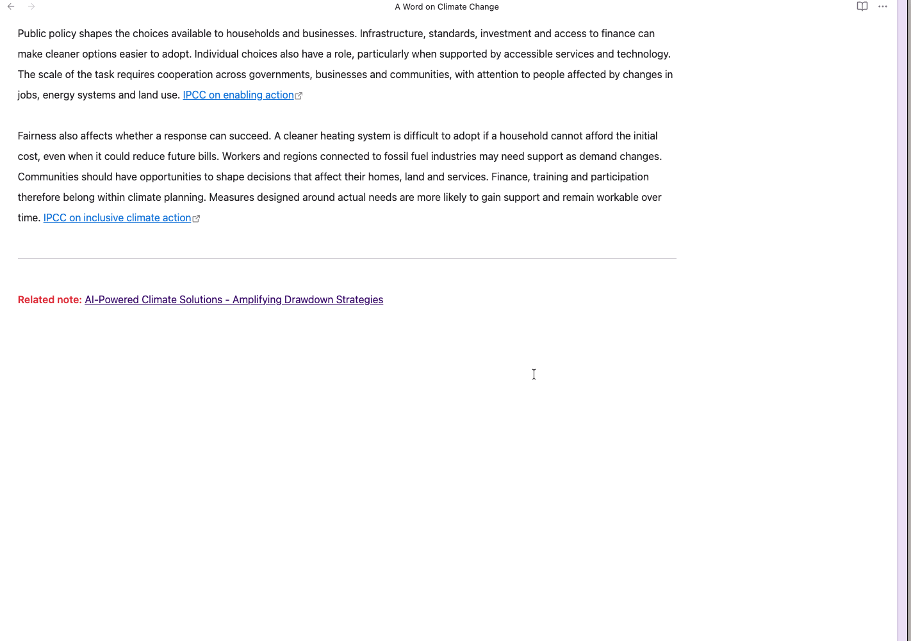

# Obsidian Discussions

A plugin for [Obsidian](https://obsidian.md) that lets you **collaborate with AI
agents through threaded discussions in your notes**. Leave instructions, ask
questions, review an agent's changes, and reply to its suggestions alongside
the content you're working on.

Comments appear in a panel with author names, timestamps, and nested replies.
They are saved directly in your Markdown files, so an agent with access to your
notes can read the conversation and write replies in the same format. You use
the discussion panel in Obsidian; the agent works with the note's text. The
conversation stays with the note, ready for the next round of feedback.

You can also use Discussions for conversations with other people or your own
review notes. No account or external discussion service is needed to store comments.



## Features

- Communicate with agents through comments stored in the note they are working on.
- View discussions in **Reading view** and **Live Preview**.
- Add comments, reply, and edit directly in the discussion panel.
- Delete a comment and its replies, or delete an entire discussion, with confirmation.
- Write Markdown in comments, including lists and internal or external links.
- See author initials, consistent avatar colours, and timestamps.
- Add empty discussions to note templates.

## Installation

Requires Obsidian **1.5.0 or newer**, as specified in the plugin manifest.

### Community plugins

Once Discussions is listed in the community directory:

1. Open **Settings → Community plugins** and turn on community plugins if needed.
2. Select **Browse** and search for **Discussions**.
3. Select **Install**, then **Enable**.

See [Obsidian's community plugin guide](https://obsidian.md/help/community-plugins)
for more about installing and enabling plugins.

### Manual installation

To install before a community listing is available, or to try a specific release:

1. Download `main.js`, `manifest.json`, and `styles.css` from a
   [GitHub release](https://github.com/deepal/obsidian-discussions/releases).
   Use the individual release files; the source archives do not contain the built plugin.
2. Create a `comment-block` folder inside your vault's `.obsidian/plugins/` folder.
3. Copy all three files into that folder.
4. Reload Obsidian, open **Settings → Community plugins**, and turn on community
   plugins if needed. Enable **Discussions** in the installed plugins list.

If your vault uses a custom configuration folder, replace `.obsidian` with its name.
If no release files are available yet, follow the [development instructions](#development)
to build the plugin from source.

## Getting started

1. Open **Settings → Discussions** and set **Your name**. If you leave it blank,
   new comments use `anonymous` as the author.
2. Open a note in editing mode and place the cursor on a blank line where you
   want the discussion to appear.
3. Open the command palette and run **Discussions: Start discussion**.
4. Type your first comment in the empty comment body, where the command places
   your cursor. Move the cursor outside the discussion, or switch to Reading
   view, to see the panel.
5. Use **Reply** to respond to a comment, or **Add comment** to start another
   top-level conversation in the same panel.

In the panel's comment and reply forms, use **Ctrl+Enter** (Windows/Linux) or
**Cmd+Enter** (macOS) to submit, and **Escape** to cancel. The buttons work too.

Use **Edit** to change a comment's text. **Delete** removes that comment and
all its nested replies after confirmation. To remove the whole panel, open
the **…** menu and select **Delete discussion**. Deleting the last comment
leaves an empty panel ready for a new conversation.

The editor shows raw tags while your cursor or selection is inside a discussion
and renders the panel when you move outside it. This also applies in Source
mode. To keep the tags visible throughout the editor, turn off **Enable comment threads**.

Try the [sample note](./docs/sample-note.md) by copying it into your vault.

## Working with agents

Use an agent that can read and edit your vault's Markdown files through your
existing agent setup. Discussions provides the conversation interface in
Obsidian; you configure and run the agent separately.

For example, when drafting or reviewing a note:

1. Add a comment with your request, such as “Review this draft and suggest a
   clearer opening. Explain your changes in a reply.”
2. Run your agent and ask it to read the note and its discussion, make the
   requested changes, and reply in the same discussion.
3. Read its response in Obsidian and use **Reply** to give feedback or ask a
   follow-up question.
4. Run the agent again when you're ready for another pass. Your instructions,
   its replies, and the note remain together.

Give the agent the [storage format](#storage-and-templates) below, or use this
instruction with your request:

> Read the note and its discussion before making changes. Write your response
> as a new `<comment>` block inside the existing `<discussion>`, using your
> agent name as `author` and a unique Unix timestamp in milliseconds as `id`.
> To reply, set `parent_id` to the ID of the comment you're answering. Append
> your block after the existing comments, before `</discussion>`, and preserve
> the existing conversation.

## Settings

| Setting | Default | What it does |
| --- | --- | --- |
| **Enable comment threads** | On | Displays discussion panels. Turn off to stop rendering them. |
| **Your name** | Blank | Sets the author name for new comments and replies; falls back to `anonymous`. |
| **Render Markdown in comments** | On | Formats comment bodies as Markdown. Turn off to display plain text. |

Changing **Your name** does not rename existing comments. Author names are labels
stored in the note; they are not verified accounts, and any comment can be edited
through the panel.

## Storage and templates

You can use the plugin without writing tags yourself. The command and panel
controls create and update them for you.

For a note template, put this empty discussion on its own line, with blank
lines around it. It renders a panel with **Add comment** ready for the first message:

```html
<discussion></discussion>
```

A discussion with a comment and a reply looks like this in the note's source:

```html
<discussion>
<comment id="1784117344071" author="You">
Could you review this draft and suggest a clearer opening?
</comment>

<comment id="1784117382527" parent_id="1784117344071" author="Agent">
I've revised the opening to state the main idea first. What do you think?
</comment>
</discussion>
```

If you edit the source by hand:

- Keep each comment's `id` unique within the note. Generated IDs are timestamps
  in milliseconds, used for creation times and chronological ordering.
- Set `parent_id` to the ID of the comment being answered, and keep the parent
  before its replies in the source. Keep all comments in the same discussion.
- Use double quotes around attribute values. Keep comment blocks flat;
  replies are linked by `parent_id`, rather than by nesting tags.
- Put only comment blocks and whitespace inside `<discussion>`. Put regular
  note content outside the wrapper, separated from it by blank lines.

Older notes with consecutive `<comment>` blocks and no wrapper are also
supported. Whitespace-separated comments form one panel; other text starts a
separate panel. Tags inside fenced code blocks or inline code are ignored.

Discussions can appear anywhere in a note; the bottom is often a convenient
place. Disabling or uninstalling the plugin leaves the stored comments in the
file, but the discussion panels require the plugin to render.

The plugin does not provide its own sharing or synchronization service. To
exchange comments with someone else, share or synchronize the note using your
existing workflow.

## Feedback

Report bugs or suggest improvements through
[GitHub issues](https://github.com/deepal/obsidian-discussions/issues).
For rendering problems, include your Obsidian version, view mode, and a small
example note that reproduces the issue.

## Development

From a local checkout, install dependencies with npm. Tests require a Node.js
version that supports `--experimental-strip-types`.

```bash
npm ci
npm run build   # Type-check and create a production main.js
npm test        # Run parser and comment-editing unit tests
npm run dev     # Watch source, manifest.json, and styles.css for changes
```

Builds stay in the repository unless you set a deployment target. Copy
`main.js`, `manifest.json`, and `styles.css` into your test vault's plugin folder,
or set `OBSIDIAN_VAULT_DIR` to deploy automatically:

```bash
OBSIDIAN_VAULT_DIR="/path/to/test-vault" npm run dev
```

The build copies the files into `.obsidian/plugins/comment-block/`, or updates
all existing plugin folders in that vault whose manifest ID is `comment-block`.
Alternatively, set `OBSIDIAN_PLUGIN_DIR` to target one plugin folder explicitly.
Both development and production builds deploy when either variable is set.
Reload the plugin in Obsidian after a rebuild to load the updated code.
